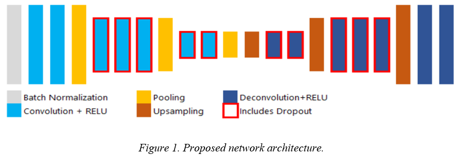

<h1 align="center">LANE DETECTION</h1>
<h2>Introduction</h2>

Lane detection is an important component of autonomous vehicle systems. Highway lane departure warning solutions have been on the market since the mid-1990s. However, improving and generalizing computer vision-based lane detection capabilities remains a challenge. A challenging and difficult task until recently.

CNN - Convolutional Neural Network, also known as the convolutional neural network, is one of the advanced and widely used Deep Learning models in image and video processing problems. 

<h2>Methods</h2>
<h3>Network Architecture</h3>

<h3>Dataset</h3>
<h4>Images</h4>

  

<h4>Labels</h4>

  

<h3>Link source code if file Lane_Detection_Using_CNN not working </h3>

<b>Please see my report</b> <a target="_blank" href="https://drive.google.com/file/d/1Ba0UAdkFfKggyYmUpo4yfSDf91mYy_J-/view?usp=share_link">here</a>

Input: An image (80, 160, 3).

Output: A binary mask.

<h3>Video demo</h3>

One of the most beautiful roads in Vietnam, it is located next to Phan Thiet beach, Binh Thuan province.

Link input video: <a target="_blank" href="https://www.youtube.com/watch?v=rOFo-bnWA9Q&t=2399s">from 31:37 to 31:47</a>

